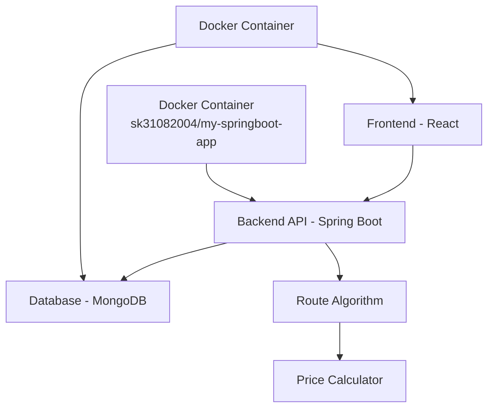

# 🚆 Train Search Web Application

<div align="center">


**A comprehensive train search platform for finding optimal routes between stations**

[](https://youtu.be/24d3XOIv0oY)
[](https://hub.docker.com/r/sk31082004/my-springboot-app)
[](https://github.com/YOUR_USERNAME/YOUR_REPO)

</div>

## 📋 Table of Contents

- [🎯 Overview](#-overview)
- [📹 Demo Video](#-demo-video)
- [✨ Features](#-features)
- [🏗️ Architecture](#️-architecture)
- [🛠️ Tech Stack](#️-tech-stack)
- [🚀 Quick Start](#-quick-start)
- [📊 Database Schema](#-database-schema)
- [🔄 API Endpoints](#-api-endpoints)
- [📱 Screenshots](#-screenshots)
- [🧪 Testing](#-testing)
- [🐳 Docker Deployment](#-docker-deployment)
- [🤝 Contributing](#-contributing)

## 🎯 Overview

The Train Search Web Application is a full-stack solution that enables users to find optimal train routes between stations. Built with modern web technologies, it provides real-time train schedules, pricing calculations, and route optimization including multi-train journeys.

### Key Highlights
- 🔍 **Smart Route Search**: Find direct and connecting routes between any two stations
- 💰 **Dynamic Pricing**: Distance-based fare calculation (₹1.25/km)
- 📊 **Sorting & Filtering**: Sort by price, duration, and departure time
- 🗄️ **Scalable Database**: Handles 1000+ trains and routes efficiently
- 🎨 **Modern UI**: Responsive design with intuitive user experience

## 📹 Demo Video

> **Note**: This is a live, unedited demo showing the complete application functionality from scratch.

<div align="center">

[](https://youtu.be/24d3XOIv0oY)

**[🎥 Watch Full Demo on YouTube](https://youtu.be/24d3XOIv0oY)**

*Duration: X minutes | Live demonstration of all features*

</div>

### Demo Highlights
- ✅ Station selection and route search
- ✅ Price calculation and sorting functionality
- ✅ Multi-train journey planning
- ✅ Database with 1000+ generated train records
- ✅ Responsive UI across devices

## ✨ Features

### 🎯 Core Functionality
- **Station Selection**: Dropdown menus with all available stations
- **Route Planning**: Find direct routes and connecting journeys
- **Price Calculation**: Automatic fare calculation based on distance
- **Smart Sorting**: Sort by price, time, or duration
- **Multi-train Routes**: Handles connecting trains for indirect routes

### 🎨 User Experience
- **Responsive Design**: Works seamlessly on desktop and mobile
- **Intuitive Interface**: Clean, modern UI with clear navigation
- **Real-time Results**: Instant search with optimized performance
- **Error Handling**: Graceful handling of no-route scenarios

### 🔧 Technical Features
- **Scalable Architecture**: Handles large datasets efficiently
- **RESTful APIs**: Well-structured backend endpoints
- **Data Generation**: Automated script for 1000+ test records
- **Docker Support**: Containerized deployment ready

## 🏗️ Architecture



## 🛠️ Tech Stack

<div align="center">

| Category | Technology | Purpose |
|----------|------------|---------|
| **Frontend** |  | User Interface |
| **Backend** |  | Server & APIs |
| **Database** |  | Data Storage |
| **Styling** |  | Responsive Design |
| **Container** |  | Deployment |

</div>

## 🚀 Quick Start

### Prerequisites
- Java 17+ and Maven
- MongoDB 4.4+
- Node.js 16+ (for frontend)
- Git

### Installation

1. **Clone the repository**
   ```bash
   git clone https://github.com/YOUR_USERNAME/train-search-app.git
   cd train-search-app
   ```

2. **Backend Setup (Spring Boot)**
   ```bash
   # Navigate to backend directory
   cd backend
   
   # Build the application
   mvn clean install
   
   # Run the Spring Boot application
   mvn spring-boot:run
   ```

3. **Frontend Setup (React)**
   ```bash
   # Navigate to frontend directory
   cd frontend
   
   # Install dependencies
   npm install
   
   # Start the development server
   npm start
   ```

4. **Environment Configuration**
   ```bash
   # Backend configuration (application.properties)
   cd backend/src/main/resources
   # Edit application.properties with your MongoDB connection string
   spring.data.mongodb.uri=mongodb://localhost:27017/traindb
   ```

5. **Generate Test Data**
   ```bash
   # Use the data generation endpoint or script
   curl -X POST http://localhost:8080/api/generate-data
   ```

6. **Access the Application**
   - Frontend: http://localhost:3000
   - Backend API: http://localhost:8080
   - API Documentation: http://localhost:8080/swagger-ui.html

## 📊 Database Schema

### Train Model
```javascript
{
  trainNumber: String,
  trainName: String,
  route: [{
    station: String,
    distanceFromPrevious: Number,
    departureTime: String,
    arrivalTime: String
  }]
}
```

### Example Route Data
```javascript
// Train A: Chennai → Vellore → Bangalore → Mysuru → Mangalore
{
  trainNumber: "12345",
  trainName: "Express A",
  route: [
    { station: "Chennai", distanceFromPrevious: 0, departureTime: "09:00" },
    { station: "Vellore", distanceFromPrevious: 170, departureTime: "11:00" },
    { station: "Bangalore", distanceFromPrevious: 200, departureTime: "15:30" },
    { station: "Mysuru", distanceFromPrevious: 120, departureTime: "17:30" },
    { station: "Mangalore", distanceFromPrevious: 300, departureTime: "21:45" }
  ]
}
```

## 🔄 API Endpoints

| Method | Endpoint | Description |
|--------|----------|-------------|
| `GET` | `/api/stations` | Get all available stations |
| `POST` | `/api/search` | Search trains for route |
| `GET` | `/api/trains` | Get all trains |
| `POST` | `/api/generate-data` | Generate test data |

### Example API Response
```json
{
  "directRoutes": [
    {
      "trainName": "Express B",
      "departure": "09:00",
      "arrival": "17:30",
      "distance": 430,
      "price": 537.5,
      "duration": "8h 30m"
    }
  ],
  "connectingRoutes": [
    {
      "trains": [
        {
          "trainName": "Express A",
          "from": "Chennai",
          "to": "Bangalore",
          "departure": "09:00",
          "arrival": "15:30",
          "distance": 370,
          "price": 462.5
        },
        {
          "trainName": "Express C",
          "from": "Bangalore",
          "to": "Mangalore",
          "departure": "16:00",
          "arrival": "23:45",
          "distance": 430,
          "price": 537.5
        }
      ],
      "totalDistance": 800,
      "totalPrice": 1000,
      "totalDuration": "14h 45m"
    }
  ]
}
```

## 📱 Screenshots

<div align="center">

### 🏠 Home Page


### 📋 Search Results


### 🔗 Multi-train Routes


</div>

## 🧪 Testing

### Run Tests
```bash
# Backend tests (Spring Boot)
cd backend
mvn test

# Frontend tests (React)
cd frontend
npm test
```

### Test Data Generation
The application includes an endpoint to generate 1000 trains with realistic routes:
```bash
curl -X POST http://localhost:8080/api/generate-data
```

## 🐳 Docker Deployment

### Quick Docker Run
```bash
# Pull and run the Spring Boot backend
docker pull sk31082004/my-springboot-app
docker run -p 8080:8080 sk31082004/my-springboot-app

# Build and run frontend
docker build -t train-search-frontend ./frontend
docker run -p 3000:3000 train-search-frontend
```

### Using Docker Compose
```yaml
version: '3.8'
services:
  backend:
    image: sk31082004/my-springboot-app
    ports:
      - "8080:8080"
    environment:
      - SPRING_DATA_MONGODB_URI=mongodb://mongo:27017/traindb
    depends_on:
      - mongo

  frontend:
    build: ./frontend
    ports:
      - "3000:3000"
    depends_on:
      - backend

  mongo:
    image: mongo:latest
    ports:
      - "27017:27017"
    volumes:
      - mongodb_data:/data/db

volumes:
  mongodb_data:
```

### Docker Hub
The backend application is available on Docker Hub:
- **Image**: `sk31082004/my-springboot-app`
- **Pull Command**: `docker pull sk31082004/my-springboot-app`

## 🤝 Contributing

We welcome contributions! Please see our [Contributing Guidelines](CONTRIBUTING.md) for details.

1. Fork the repository
2. Create a feature branch (`git checkout -b feature/AmazingFeature`)
3. Commit your changes (`git commit -m 'Add some AmazingFeature'`)
4. Push to the branch (`git push origin feature/AmazingFeature`)
5. Open a Pull Request

---

<div align="center">

**⭐ Star this repository if it helped you!**

Made with ❤️ for efficient train travel planning

[](https://github.com/YOUR_USERNAME/YOUR_REPO/stargazers)
[](https://github.com/YOUR_USERNAME/YOUR_REPO/network/members)

</div>
